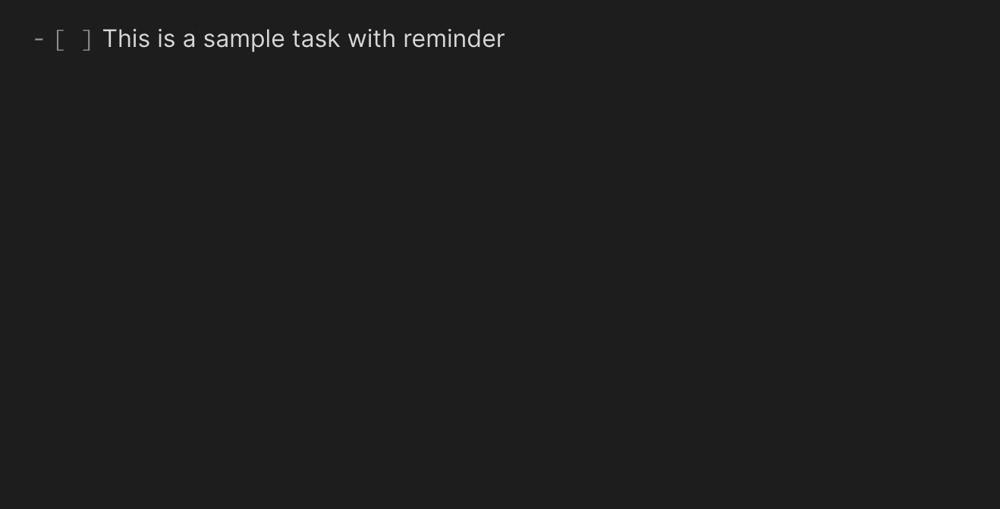
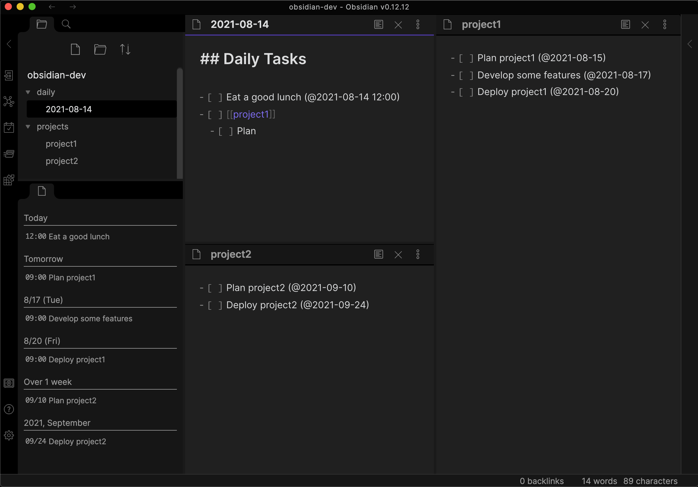
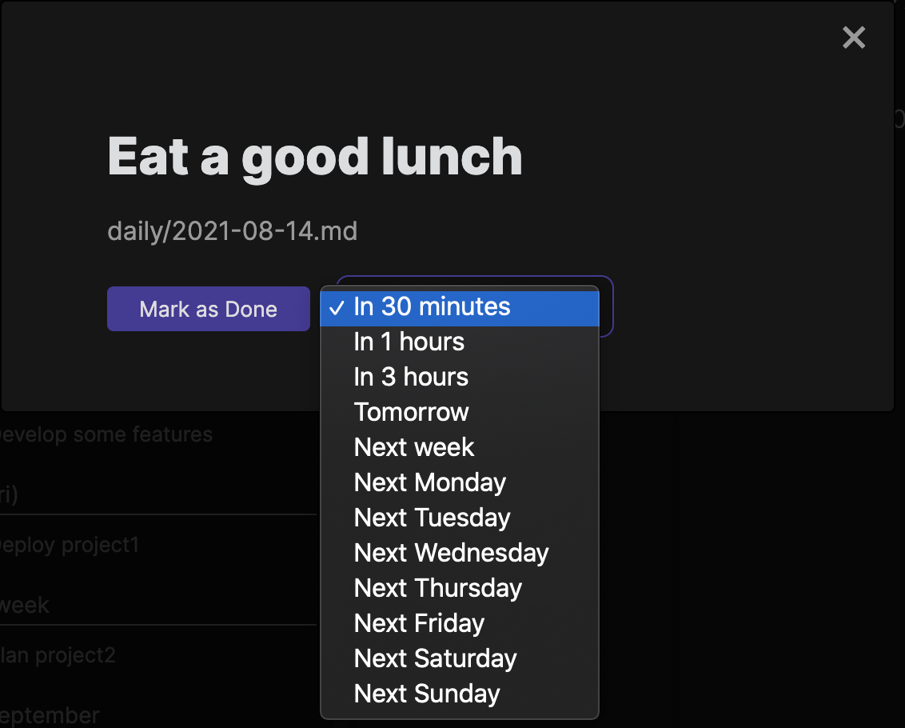

## Obsidian Reminder Plugin

Reminder plugin for Obsidian. This plugin adds feature to manage markdown TODOs with reminder.

### Features

#### Set Reminders

You can set reminders for TODO list items with the following format.

```markdown
- [ ] This is a sample task with reminder (@2021-08-14)
- [ ] Also you can specify time (@2021-08-14 09:37)
- [x] You will not be notified about the reminders you have already checked. (@2021-08-14)
```

If you input `(@` (start of the reminder date time), calendar popup to set the reminder date time will show.


#### List Reminders

You can view the list of reminders contained in all files.



If you click the reminder list item, the source markdown file will be appeared.

#### Reminder Notification

Reminder will be notified on Obsidian when the time comes.


If you click `Mark as Done`, your check list item will be checked.
Alternatively, you can postpone the reminder by selecting `Remind Me Later`.



### Settings

- Reminder Time: Time when the reminder which has time part will show (HH:mm)
### TODO

- [ ] Reminder input support (develop a CodeMirror plugin)
- [ ] More settings
  - [ ] Date time format
  - [ ] Use system notification
